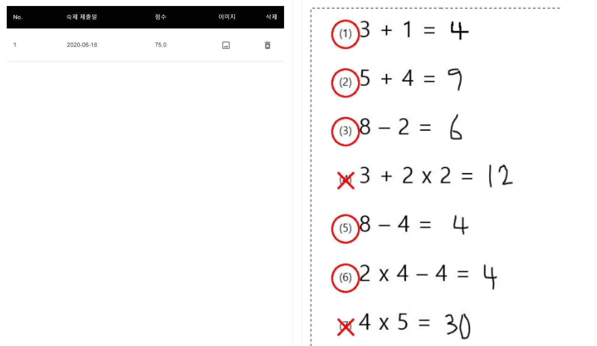
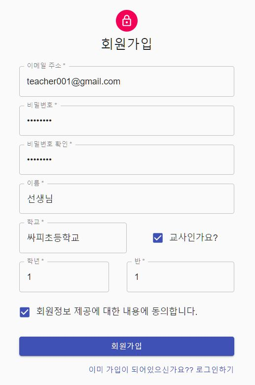
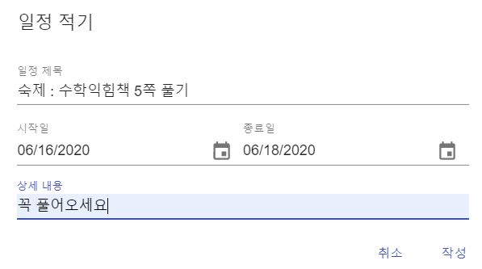
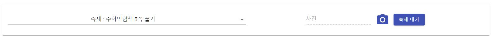

<h1 align="center">
<!-- <br /><br />-->
  머신러닝을 이용한 지능형 온라인 과제 관리 시스템 𝙃𝙤𝙢𝙚𝙇𝙚𝙖𝙧𝙣
  <br />
  ₂₀.₀₅.₀₄ ₋ ₂₀₂₀.₀₆.₀₉
</h1>

<div align="center">
  
  [](#contributors-)
  
  

</div>

<br/>

## Contributors ✨
Thanks goes to these wonderful people

<!-- ALL-CONTRIBUTORS-LIST:START - Do not remove or modify this section -->
<!-- prettier-ignore-start -->
<!-- markdownlint-disable -->
<table>
  <tr>
    <td align="center">
      <a href="https://github.com/hyeokinen")></a><br />
      <a href="https://github.com/hyeokinen") title="Code">
        <sub><b>Hyoek</b></sub><br />💻
      </a>
    </td>
    <td align="center">
      <a href="https://github.com/NamSeonWoong"></a><br />
        <a href="https://github.com/HelomeProject/HelpHomework/commits?author=NamSeonWoong" title="Code">
          <sub><b>NamSeonWoong</b></sub><br />💻
      </a>
  </tr>
</table>
<!-- markdownlint-enable -->
<!-- prettier-ignore-end -->
<!-- ALL-CONTRIBUTORS-LIST:END -->

<!--
| 이름       | 역할  | 담당 업무                                                    |
| ---------| ----- | ------------------------------------------------------------ |
| 김건혁     | FE/BE | React.js FE 개발 및 배포, Django BE 개발 및 배포, 프로젝트 관리 및 운영 |
| 하성민     | FE    | React.js FE 개발, UI 구현 (Material UI), UCC 제작 및 시연    |
                      Springboot-MyBatis BE 개발 및 배포, DB 설계 및 구축 (MySQL), AWS Maintainer, Git Maintainer |
                      머신러닝 알고리즘 (Tensorflow Keras), 수식 이미지 인식(OpenCV), 숫자/기호 데이터 수집 및 변환, 수식 예측 알고리즘 |
-->

<br/>

## 🧐 Features
</a><br />

* 보다 쉬운 학사 관리를 위한 공지사항 및 과제 관리 Scheduler
* 과제 업로드 시, 해당 과제에 대한 정답/오답 여부 및 점수 실시간 확인 가능

<br />
<!--​-->


## 🛠️ Getting Start

<p><b>1. Deep Learning 모델 만들기<b/></p>

[링크 :bookmark:](https://drive.google.com/file/d/1tQzC7I_xDwOXlpHZiSGoNp8zx6Yon-cs/view?usp=sharing)와 [문서 :page_facing_up:](./makedataset.md) 참고
<!--1번 Deep Learning 모델 만들기를 생략하고 싶을 때 링크에서 다운받으면 됨-->

<br/>

<p><b>2. train.py 실행</b></p>

```bash
pip install -r requirements.txt
```

<br/>

<p><b>3. model.hdf5, classes.pkl 파일 생성</b></p>

생성된 파일(model.hdf5, classes.pkl) MLSERVER 폴더로 복사이동

<br />

<p><b>4. FE서버 실행</b></p>

```bash
npm install
npm start
```

<br/>

<p><b>5. BE(Spring) 서버 실행</b></p>

```bash
java -jar BootWeb-~~~ .war
```

<br />

<p><b>6. BE(Django) 서버 실행</b></p>

```bash
pip install -r requirements.txt
python manage.py runserver
```


<!--실행하기 전에 MLSERVER 폴더에서 터미널에서 다음 명령어를 타이핑해필요한 파이썬 패키지를 설치해준다.
```
pip install -r requirements.txt
```
그 후에 Django server를 실행시킨다.
```
python manage.py runserver
```
-->

<!--
## 5. 핵심 기능 실행하기
### 1. 교사 아이디 생성 후 로그인하기

### 2.  숙제 내기
​	로그인하면 달력 페이지에서 시작일을 클릭하면 숙제를 낼 수 있는 팝업이 뜬다.

### 3. 학생 아이디 생성 및 로그인하기
첫번째의 선생님 아이디 만들 때 처럼 회원가입을 하는데 단 회원가입 시 교사인가요 부분을 체크 해제한다.
### 4. 학생 숙제 제출
왼쪽 상단에 제출 현황 탭을 누르면 선생님이 숙제를 낸 목록을 볼 수 있고 옆에 파일 첨부를 통해 숙제를 재출한다.

### 결과
#### 제출한 파일

#### 홈페이지 결과

-->

<br />
<hr>
<p align="center">
𝗗𝗲𝘃𝗲𝗹𝗼𝗽𝗲𝗱 𝘄𝗶𝘁𝗵 ❤ 𝗶𝗻 Gachon
</p>
