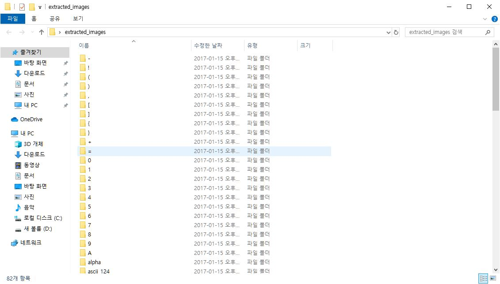
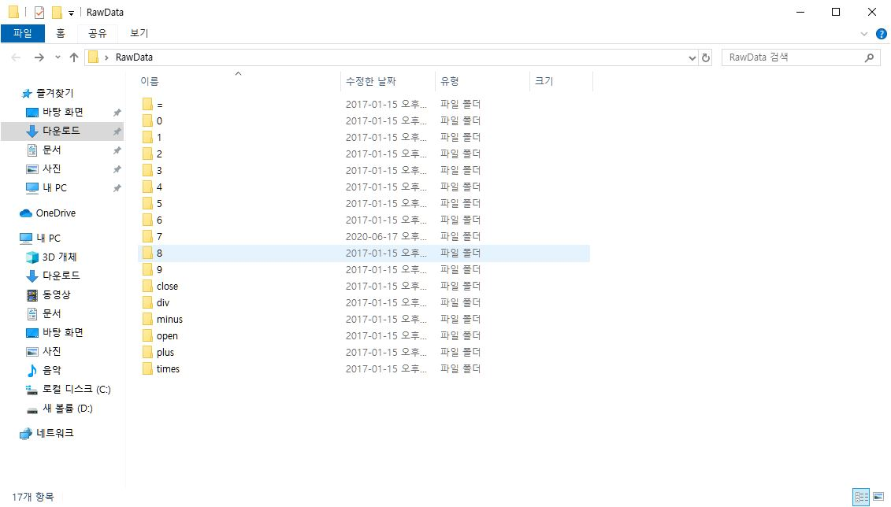
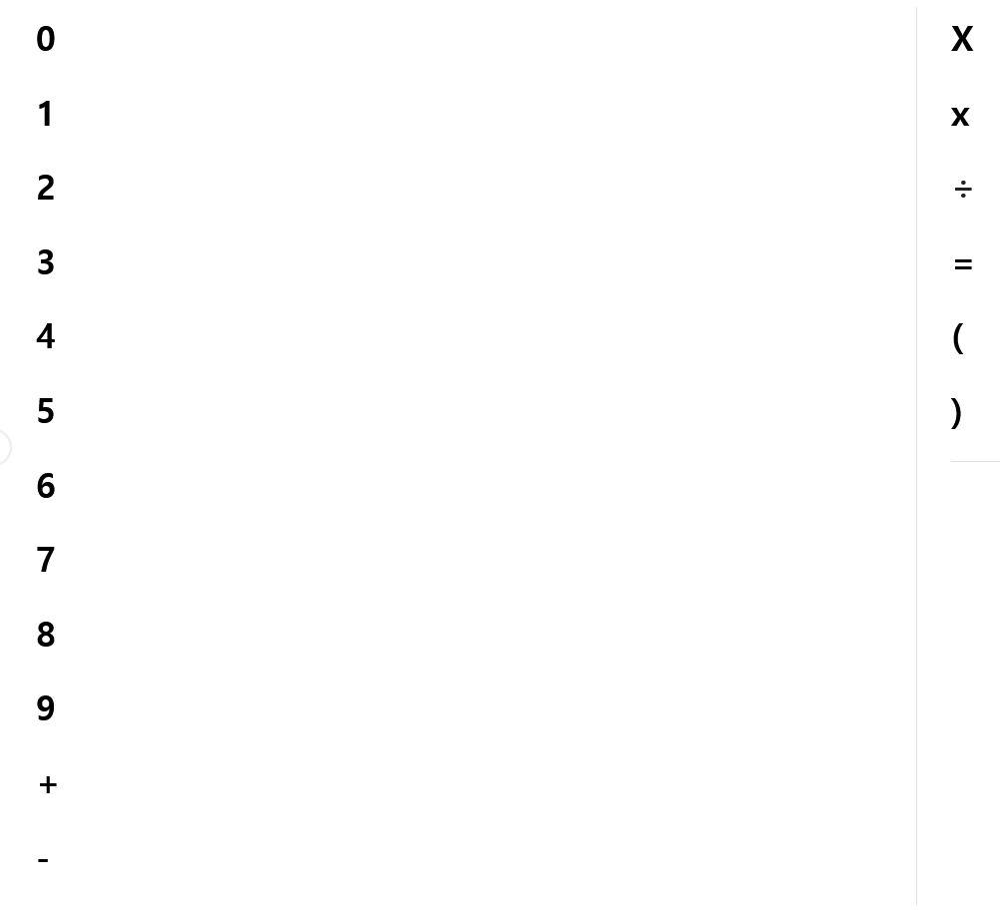
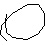

## 숫자 및 사칙연산 Dataset 만드는 방법

### 1. kaggle에서 다음 url의 데이터 다운로드

https://www.kaggle.com/xainano/handwrittenmathsymbols

다음 데이터는 수학기호 및 숫자 손글씨 데이터입니다.

### 2. 다운받은 데이터 중 쓸 데이터만 분류

데이터 압축을 풀면 많은 수학기호가 있는데 여기서 **[0, 1, 2, 3, 4, 5, 6, 7, 8, 9, +, -, times, div, (, ), = ]** 의 폴더만 제외하고 전부 삭제해준다. 그리고 **[0, 1, 2, 3, 4, 5, 6, 7, 8, 9, +, -, times, div, (, ), = ]**를 담은 폴더 이름을 **RawData**로 이름을 바꿔준다. 그 후 **+ -> plus**, **- -> minus**, **( -> open**, **) -> close**, **= -> equ**로 폴더이름을 바꿔준다.

#### 전

#### 후

### 3. 인쇄체 데이터를 직접 만들기

1 에서 다운받은 데이터는 오직 손글씨 데이터만 있으므로 인쇄된 서체에 대해서는 인식을 못하므로 수동으로 만들어줘야 한다. 다음 이미지는 word에서 숫자, 연산기호를 작성한 사진이다. 이 걸 하나씩 캡처도구로 잘라서 RawData 폴더에 각 항목에 맞게 넣어준다. (각 항목당 10개정도 넣어준다.)

### 4. 이미지 데이터 전처리

만들어진 Dataset을 이제 ML 폴더 내에 복사 후 change_img.py를 실행시켜 데이터를 전처리해준다.

이 코드를 실행시키면 실행결과 예시처럼 결과가 저장된다.

#### 실행결과 예시

|                   전                    |                  후                   |
| :-------------------------------------: | :-----------------------------------: |
|  |  |

